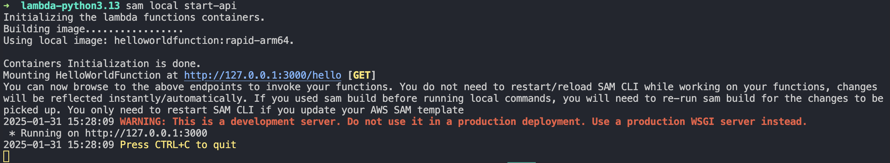

# transformation_trigger
A repo for the mirrulations trigger to transform data

s3-test1 bucket link: https://us-east-1.console.aws.amazon.com/s3/buckets/mirrulations-test1

s3-revised bucket link: https://us-east-1.console.aws.amazon.com/s3/buckets/mirrulations-revised-form

We initially developed our local infracture on local deployments of the AWS Server Application Model (SAM). We based the initial example of the of the provided 'Hello World' example from the SAM quick templates.

## Get Started

- To start, download the AWS SAM CLI [here](https://docs.aws.amazon.com/serverless-application-model/latest/developerguide/install-sam-cli.html#install-sam-cli-instructions).
- We utilized Docker for the containerized deployment of the infrastructure, download Docker Desktop [here](https://www.docker.com/products/docker-desktop/)

- Clone this repository
- `cd` into dev-env 
- Run `sam build --use-container` to download the ECR image for python
- Run `sam local invoke HelloWorldFunction --event events/event.json`
- Run `sam local start-api` to initialize the container and visit the link that the program prints out (for example: localhost:3000/hello)

